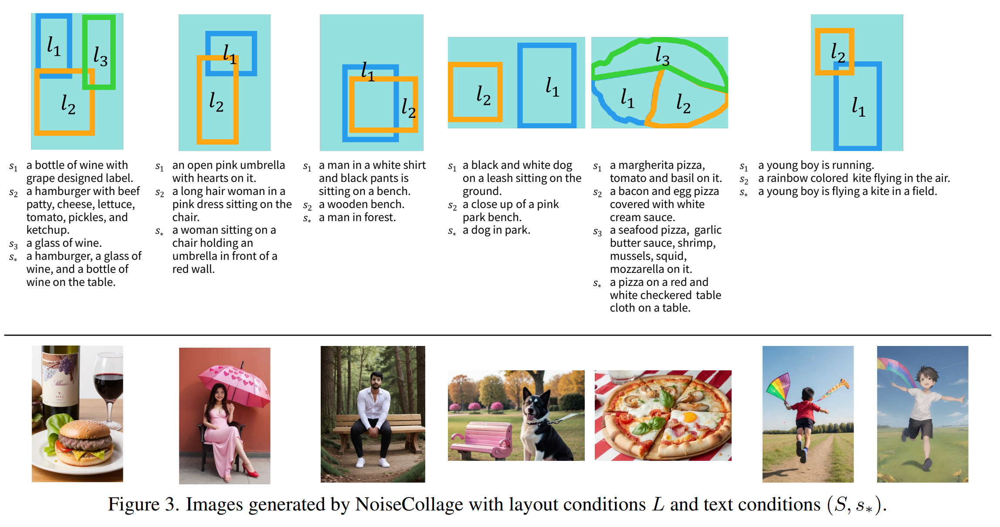
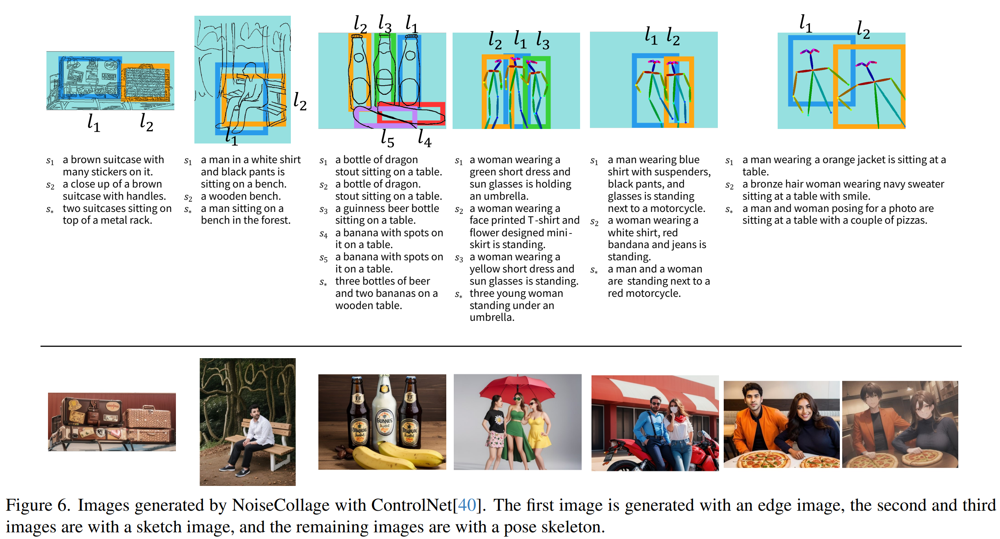

# NoiseCollage
NoiseCollage: A Layout-Aware Text-to-Image Diffusion Model Based on Noise Cropping and Merging  
This is an official repository for the paper, NoiseCollage, which is a revolutionary extension of text-to-image diffusion models for layout-aware image generation.
This paper is accepted at CVPR2024.

ArXiv -> https://arxiv.org/abs/2403.03485

NoiseCollage is a novel layout-aware text-to-image diffusion model to tackle several issues, including mismatches between the text and layout conditions and quality degradation of generated images in SoTA models.
During the denoising process, NoiseCollage independently estimates noises for individual objects and then crops and merges them into a single noise. 
This operation helps avoid condition mismatches; in other words, it can put the right objects in the right places. 
It is a training-free method and can be applied to text-to-image diffusion models such as StableDiffusion(SD1.5/2.1) and supports integration with [ControlNet](https://github.com/lllyasviel/ControlNet).

This repository contains codes for implementation of NoiseCollage based on [diffusers](https://github.com/huggingface/diffusers). 
The codes heavily depend on `diffusers` and we would like to thank all those involved. 

#### Generated Results
1. An example of layout/caption conditions and corresponding generated images by NoiseCollage. 
  

2. An example of NoiseCollage and ControlNet integration.



## Environment setup
1. We tested all codes in `Python: 3.8.10`. Make a virtual environment.
```
python3.8 -m venv noisecollage
source noisecollage/bin/activate
```

2. You need to download external libraries with pip as follows.
```
pip install --upgrade pip
pip install torch==2.0.1+cu117 torchvision==0.15.2+cu117 torchaudio==2.0.2+cu117 --extra-index-url https://download.pytorch.org/whl/cu117
pip install -r requirements.txt
```
Note: We modified some codes in `diffusers` therefore you don't install original version of `diffusers`.
You also need to download pre-trained StableDiffusion weights from `HuggingFace`(https://huggingface.co/***).


## Implementation
1. Make input conditions
First, make folders corresponding to each region in a layout. The folder name must be `PALL` (corresponding to whole image) and `PXXX` (corresponding to each region).
Second, make mask images to specify each layout with bbox or segmentation. The mask images are binary images and the name must be `bbox_mask_image` or `mask_image`. 
Third, make caption files corresponding to each region.
Optionally, make controlnet condition images.
Please refere the folder `sample_inputs/*` for details.

2. Image generation
Edit the configuration `ExpConfigs` in `gen_img_by_noisecollage.py` and run the code as follows. We recommend to set `batch_size≧4` to get the best quality image.  
```
python gen_img_by_noisecollage.py
```

3. Image Generation with ControlNet
Edit the configuration `ExpConfigs` in `gen_img_by_noisecollage-with-controlnet.py` and run the code as follows.
```
python gen_img_by_noisecollage-with-controlnet.py
```
Note: Masked Cross-Attention (mentioned at 3.3 in the paper) is not necessary when integrating NoiseCollage with ControlNet(sketch, pose, canny, ...).

4. Image generation with LoRA models.
Edit the configuration `ExpConfigs` in the code to set your LoRA model path and run the code following step 2 and 3.
Applying multiple LoRA models is not currently supported but can be done with a minor code modification. 
It is also possible to apply a LoRA model to the region A and the other LoRA model to region B. 
This will allow for more flexible image generation.

Important!: Please handle generated images with caution because `safety_checker()` is commented out to facilitate debugging.

## Next >>
1. Limitations
* There is room for improvement in layout accuracy of generated images in complex layout scenarios.
* NoiseCollage cannot be applied directory to `SDXL` due to some changes in text-embedding mechanism.

2. Future works
* Improve Masked Cross-Attention or replace it to another mechanism.
* Apply NoiseCollage to SD3 which is a transformer based architecture text-to-image diffusion model.
* Apply NoiseCollage to the other diffusion models such as video, 3D model, and categorical data generation?


## bibtex
We will update here soon.
